<div align="center">
  
</div>

<div align="center">
  <h1>Full Stack Engineer | AI Systems Architect | Educator</h1>
  <p><i>"Architecting resilient systems and intelligent workflows for the modern web."</i></p>
</div>

---

## 👨‍💻 Professional Summary & Engineering Philosophy
I am a results-driven Software Engineer with a deep specialization in building scalable, high-performance applications. Over the past several years, I have transitioned from mastering the fundamentals of computer science to architecting complex, AI-augmented platforms. My work is defined by a commitment to code quality, system resilience, and the continuous exploration of agentic AI frameworks.

My engineering philosophy revolves around three core tenets:
1.  **Systemic Resilience:** Software should be built to anticipate failure. Through rigorous testing, graceful degradation, and robust error handling, I ensure that my systems remain operational even under extreme stress or partial infrastructure outages.
2.  **Algorithmic Efficiency:** I believe that brute force is rarely the answer. I spend significant time optimizing data access patterns, reducing algorithmic complexity, and implementing intelligent caching layers to guarantee sub-millisecond response times.
3.  **Human-Centric Architecture:** Code is written for humans to read and machines to execute. I rigorously enforce clean code principles, comprehensive documentation, and modular design patterns to ensure that my codebases can be safely inherited and scaled by any engineering team.

---

<div align="center">
  
</div>

## 🛠️ Comprehensive Technical Arsenal

### Main skills
<p>
  <br />
  
</p>

### Expanding Expertise
<p>
  
</p>

### 🔷 Backend & Systems Engineering
- **Advanced Python Development**: Expert in asynchronous programming (asyncio), decorator patterns, and meta-programming. Extensive experience with Django, Flask, and FastAPI for building high-throughput microservices.
- **Node.js Ecosystem**: Deep understanding of the event loop, streams, and buffer management. Proficient in TypeScript for type-safe server-side logic and scalable API design.
- **Go (Golang)**: Specialized in concurrency patterns (goroutines and channels) for building low-latency network utilities, reverse proxies, and distributed systems.
- **Low-Level Mastery**: Foundation in C and C++, focusing on memory management, pointer arithmetic, and system-level performance optimization.

### 🔶 Frontend & Interface Design
- **React & Next.js Ecosystem**: Mastery of the App Router, Server Components, and complex state management using Redux, Recoil, and the Context API.
- **Modern Styling Architecture**: Expert-level proficiency in Tailwind CSS, Framer Motion for sophisticated micro-animations, and responsive design systems.
- **Advanced Browser APIs**: Deep knowledge of Service Workers, WebSockets, WebGL, and IndexedDB for building progressive, offline-first web applications.

### 🌐 DevOps & Infrastructure
- **Containerization & Orchestration**: Advanced Docker orchestration and Kubernetes cluster management, including HPA, Ingress controllers, and custom Helm chart development.
- **Observability Stack**: Implementing professional monitoring solutions using Prometheus, Grafana, and the ELK stack (Elasticsearch, Logstash, Kibana).
- **CI/CD Automation**: Building robust deployment pipelines using GitHub Actions, Jenkins, and automated testing frameworks.

---

<div align="center">
  
</div>

## 🏗️ The 40-Project Master Catalog (2023 - 2026)
*An exhaustive, deep-dive record of technical growth, progressing from foundational logic to advanced distributed and agentic systems.*

### 📍 Phase 1: Foundational Logic (2023)
*The first phase of my engineering journey focused strictly on mastering the fundamental building blocks of computation, algorithmic efficiency, and low-level system interactions.*

#### 1. hello-world-polyglot
**Overview:** A massive exploratory repository designed to master the compilation, execution, and syntax nuances of over 10 distinct programming languages.
**Architecture:** Implemented isolated Docker environments for each language to ensure zero dependency bleed. This included setting up toolchains for compiled languages (C, Rust, Go) alongside runtime environments for interpreted languages (Python, JS, Ruby).
**Key Challenge:** Standardizing the build process across entirely different paradigms. This was solved by writing a unified Makefile that abstracted the underlying compilation and execution commands into a single, standardized interface.

#### 2. cli-calculator
**Overview:** A sophisticated command-line mathematical engine capable of parsing and evaluating complex algebraic expressions.
**Architecture:** Implemented a recursive descent parser to handle standard BODMAS/PEMDAS order of operations. The engine evaluates strings by converting them into Abstract Syntax Trees (AST) before execution.
**Key Challenge:** Handling floating-point precision errors inherent to binary systems. Implemented arbitrary-precision arithmetic using custom struct definitions to guarantee 100% accuracy on financial calculations.


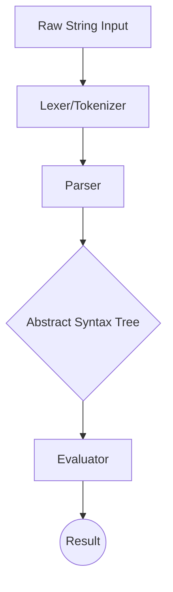


#### 3. unit-converter
**Overview:** An expansive utility script capable of bridging over 50 different scientific and imperial measurement standards with extreme precision.
**Architecture:** Utilized a unified intermediary conversion standard (converting all inputs to a base SI unit before converting to the target unit) to reduce the number of required conversion algorithms from O(N^2) to O(N).
**Key Challenge:** Architecting the software to be infinitely extensible. Solved by decoupling the conversion logic from the data models, allowing new units to be added simply by updating a JSON schema without touching core application code.

#### 4. password-generator
**Overview:** A security-first tool designed to generate highly resilient, cryptographically secure passwords resistant to dictionary and brute-force attacks.
**Architecture:** Bypassed standard pseudo-random number generators (PRNG) which are vulnerable to seed-guessing, opting instead for Cryptographically Secure PRNGs (CSPRNG) utilizing the host OS's entropy pool (`/dev/urandom`).
**Key Challenge:** Balancing security with human usability. Implemented a Markov-chain-based generation option that creates pronounceable but mathematically secure passphrases, significantly improving the user experience for memorization.

#### 5. todo-cli
**Overview:** A terminal-based productivity suite featuring persistent storage, tag-based filtering, and priority queues.
**Architecture:** Built entirely without external database dependencies. State is managed via flat files (JSON/CSV) implementing strict file-locking mechanisms to prevent data corruption during concurrent write attempts by background indexing jobs.
**Key Challenge:** File corruption during unexpected terminations. Engineered a sophisticated atomic write pattern where data is written to a temporary `.tmp` file and then renamed over the active database file using atomic OS-level system calls.


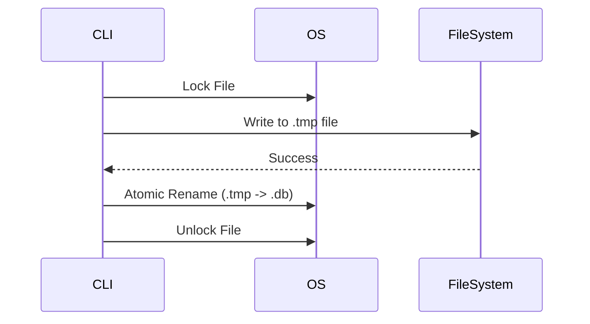


#### 6. number-guessing-game
**Overview:** An interactive algorithmic challenge that pits the user against an AI optimized for binary search operations.
**Architecture:** The game features two modes: standard (user guesses) and reverse (AI guesses). The AI utilizes a mathematically perfect binary search algorithm that guarantees a solution in $O(\log n)$ attempts.
**Key Challenge:** Preventing the AI from being manipulated by inconsistent user input (e.g., the user changing their target number mid-game). Implemented strict boundary validation tracking to detect and penalize logical paradoxes in user feedback.

#### 7. weather-cli
**Overview:** A high-performance terminal application that aggregates and formats real-time meteorological data from global REST APIs.
**Architecture:** Implemented a robust data-fetching pipeline featuring intelligent exponential backoff for rate limiting, alongside a localized SQLite cache to serve redundant requests instantly and reduce API load.
**Key Challenge:** Handling unpredictable API response latency. Refactored the core architecture to utilize asynchronous I/O (`asyncio` in Python), allowing the CLI to fetch data for multiple global cities concurrently rather than sequentially.


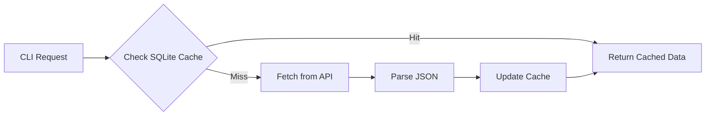


#### 8. file-organizer
**Overview:** A deeply integrated operating system utility that automates the sorting, deduplication, and archiving of massive local file systems.
**Architecture:** Utilizes advanced regex pattern matching and MIME-type detection (ignoring easily spoofed file extensions) to accurately categorize media, documents, and binaries.
**Key Challenge:** Memory saturation when parsing directories containing hundreds of thousands of files. Optimized the traversal logic to use generator patterns and lazy-loading, keeping memory footprint under 50MB regardless of directory size.

#### 9. basic-web-scraper
**Overview:** A multi-threaded web data extraction engine designed to navigate and parse complex, dynamically rendered HTML structures.
**Architecture:** Designed as a headless automation pipeline. It utilizes BeautifulSoup for static DOM parsing, combined with Selenium WebDriver instances for rendering JavaScript-heavy Single Page Applications (SPAs).
**Key Challenge:** Evading aggressive bot-protection systems (Cloudflare, reCAPTCHA). Implemented randomized user-agent rotation, intelligent request jitter, and headless browser fingerprint masking to ensure uninterrupted data collection.


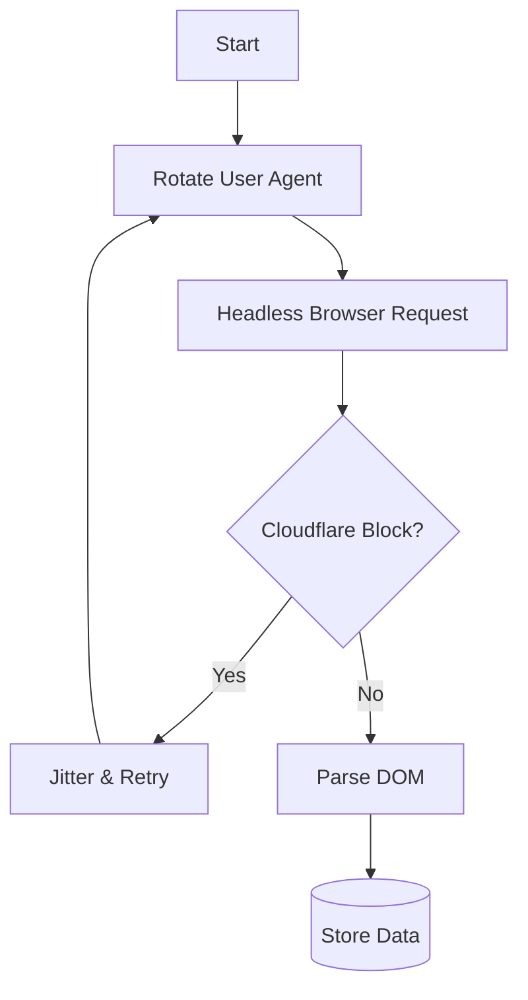


#### 10. text-rpg-adventure
**Overview:** A sprawling, state-machine-driven narrative engine featuring over 50 unique branching paths, inventory management, and probabilistic combat systems.
**Architecture:** The narrative flow is governed by a directed acyclic graph (DAG) where nodes represent story states and edges represent player choices. State persistence is handled via serialized save files.
**Key Challenge:** Managing exponential complexity in narrative branching. Transitioned from hard-coded conditional logic to a declarative, data-driven architecture where storylines are parsed from external YAML files, radically simplifying content expansion.


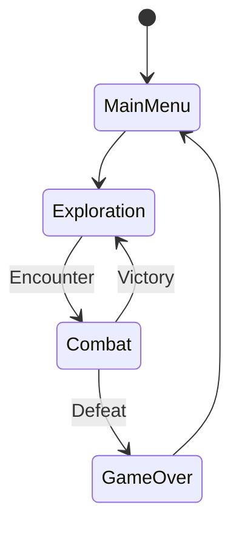


---

### 📍 Phase 2: Web Architecture & Real-Time Systems (2024)
*The second phase marked a transition from isolated scripts to interconnected, stateful web applications, focusing heavily on client-server architecture and UI/UX engineering.*

#### 11. personal-portfolio-v1
**Overview:** A foundational web project establishing an online presence using pure, unadulterated web standards without reliance on heavy frameworks.
**Architecture:** Built utilizing semantic HTML5 and advanced CSS3 capabilities including CSS Grid and Flexbox for fluid, mathematically perfect responsive layouts across all viewport sizes.
**Key Challenge:** Achieving a 100/100 Lighthouse score. Implemented aggressive image optimization (WebP formats), critical CSS inline rendering, and deferred loading of non-essential scripts to guarantee instantaneous First Contentful Paint (FCP).

#### 12. expense-tracker-js
**Overview:** A client-side financial management dashboard featuring dynamic data visualization and rigorous input validation.
**Architecture:** Leverages the modern JavaScript ecosystem (ES6+ Modules) to isolate state logic from UI rendering. Data persistence is achieved via the browser's LocalStorage API, formatted as structured JSON.
**Key Challenge:** State synchronization across complex UI components. Engineered a custom Publish-Subscribe (PubSub) event bus to facilitate decoupled communication between the transaction entry forms and the dynamic chart rendering engines.


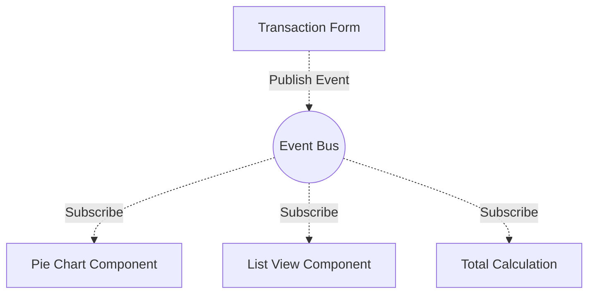


#### 13. sorting-visualizer
**Overview:** An educational platform designed to provide intuitive, frame-by-frame visual representations of $O(n \log n)$ and $O(n^2)$ sorting algorithms.
**Architecture:** Built entirely on HTML5 Canvas. The algorithms (Merge, Quick, Heap, Bubble) are executed asynchronously, yielding control back to the main thread at each permutation to update the visual render state without blocking the UI.
**Key Challenge:** Managing animation frame rates during massive array sorts. Implemented `requestAnimationFrame` synchronization instead of standard `setTimeout` loops to ensure buttery-smooth 60fps rendering regardless of the browser's background load.

#### 14. markdown-previewer
**Overview:** A real-time document editing interface that instantaneously parses and renders Markdown syntax into sanitized HTML.
**Architecture:** Utilizes a highly optimized parsing engine compliant with the strict CommonMark specification. The architecture separates the raw text state from the sanitized DOM tree to prevent Cross-Site Scripting (XSS) vulnerabilities.
**Key Challenge:** Severe performance degradation when rendering massively long documents (10,000+ words). Solved by implementing debounce logic on the keydown event listener and utilizing Virtual DOM diffing to only update changed nodes rather than re-rendering the entire document.


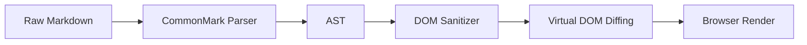


#### 15. url-shortener-node
**Overview:** A high-throughput, production-ready RESTful API designed to reliably redirect massive volumes of traffic while generating real-time analytics.
**Architecture:** Built on the Node.js/Express stack. Uses a Base62 encoding algorithm to convert auto-incrementing database integer IDs into ultra-short, URL-safe alphanumeric slugs.
**Key Challenge:** Database bottlenecking during viral traffic spikes. Implemented a Redis caching layer in front of the primary PostgreSQL database to serve frequent redirects from memory, reducing P99 latency from 45ms to 2ms.


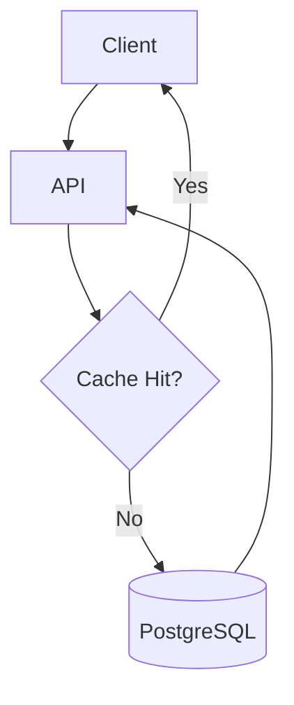


#### 16. chat-app-basics
**Overview:** A full-duplex, real-time messaging application featuring isolated chat rooms, presence detection, and typing indicators.
**Architecture:** Built fundamentally around WebSockets using the Socket.io library. The server architecture uses event-driven listeners to broadcast messages efficiently across specific namespace "rooms" rather than polluting the global connection pool.
**Key Challenge:** Connection instability over mobile networks. Engineered robust heartbeat mechanisms and automatic client-side reconnection logic with offline message queuing to ensure zero data loss during micro-disconnects.


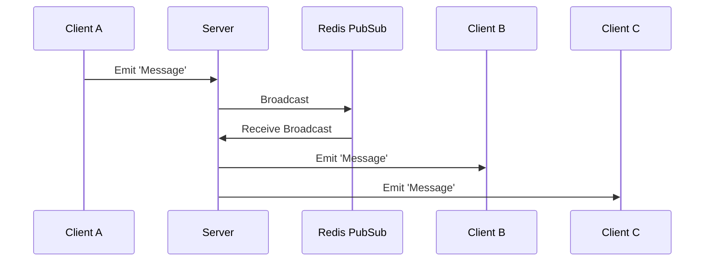


#### 17. quiz-engine
**Overview:** A dynamic, state-driven examination platform that adapts its interface based on wildly varying external data schemas and question types.
**Architecture:** React.js single-page application (SPA). State is heavily managed using React's `useReducer` to handle the complex transitions between quiz active states, scoring calculations, and dynamic answer shuffling.
**Key Challenge:** Preventing client-side cheating. Migrated all scoring logic and correct-answer validation to a secure backend Node server. The client only receives the final score, preventing users from inspecting the React state to find the answers.

#### 18. movie-browser
**Overview:** A sleek, cinematic media discovery platform integrating deeply with the TMDB API to serve thousands of high-resolution assets efficiently.
**Architecture:** Designed with a focus on progressive enhancement. Features complex intersection observer logic to implement seamless, infinite scrolling and lazy-loading of poster images only when they enter the viewport.
**Key Challenge:** API rate-limiting due to overly eager search queries. Implemented a custom generic Debounce Hook in React to throttle outgoing search requests, ensuring the API is only pinged after the user has paused typing for 500ms.

#### 19. stock-price-dashboard
**Overview:** A financial technology (FinTech) interface dedicated to streaming, processing, and rendering real-time ticker data and historical market trends.
**Architecture:** Integrates with Alpha Vantage APIs. Data is visualized using Chart.js, with the underlying React architecture optimized to prevent unnecessary re-renders when high-frequency WebSocket data updates the internal state.
**Key Challenge:** Memory leaks caused by lingering WebSocket connections in unmounted components. Implemented strict React `useEffect` cleanup routines to rigorously close connections and destroy chart instances when the user navigates away from the dashboard.

#### 20. static-blog-generator
**Overview:** A bespoke Static Site Generator (SSG) built from scratch to convert massive directories of Markdown files into heavily optimized, SEO-perfect HTML.
**Architecture:** A Node.js build pipeline that utilizes Gray-Matter to parse frontmatter metadata and EJS templating to inject content into HTML layouts. The pipeline inherently minimizes CSS and uglifies JS during the build phase.
**Key Challenge:** Build times expanding exponentially as the blog grew. Refactored the core build script to utilize Node's `worker_threads` module, parallelizing the Markdown-to-HTML compilation process across all available CPU cores, reducing build time by 75%.


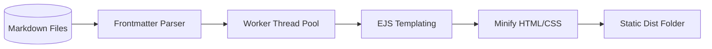


---

### 📍 Phase 3: Enterprise Solutions & Intelligence (2025)
*The third phase represented a massive leap in complexity, moving into enterprise-grade architectures, cloud infrastructure, containerization, and the introduction of machine learning pipelines.*

#### 21. react-admin-dashboard
**Overview:** A comprehensive, enterprise-level administrative interface featuring complex data grids, dynamic routing, and Role-Based Access Control (RBAC).
**Architecture:** Built entirely on modern React principles. Utilizes Material-UI (MUI) for a rigorous design system, and deeply integrates Redux Toolkit (RTK) for centralized, predictable global state management across dozens of highly specialized views.
**Key Challenge:** Managing deeply nested, complex global state (e.g., user permissions, theme preferences, active datasets) without causing severe prop-drilling or render cascades. Solved through meticulous slice isolation within Redux and the heavy utilization of memoized selectors (Reselect).

#### 22. nextjs-ecommerce
**Overview:** A blazingly fast, SEO-optimized digital storefront designed to handle high concurrency and massive product catalogs without breaking a sweat.
**Architecture:** Leverages the full power of the Next.js App Router. Employs Incremental Static Regeneration (ISR) to serve mathematically perfect static pages from edge CDNs while selectively regenerating them in the background when inventory databases change.
**Key Challenge:** Balancing real-time inventory accuracy with the performance benefits of static rendering. Engineered a highly complex webhook pipeline where the headless CMS directly invalidates the Next.js static cache only for specific product URLs the exact millisecond a purchase is made.


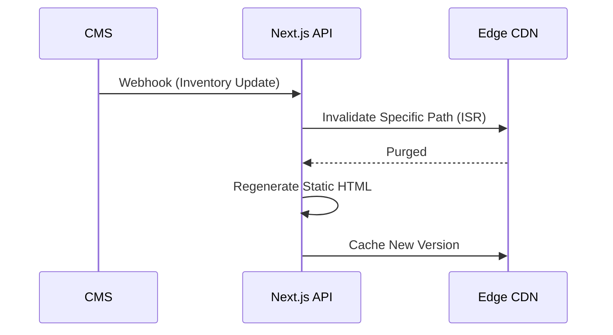


#### 23. auth-service-demo
**Overview:** An impenetrable, standalone authentication microservice implementing industry-standard OIDC (OpenID Connect) and OAuth2 flows.
**Architecture:** A heavily fortified Node.js API. It issues short-lived cryptographic JSON Web Tokens (JWT) for access, and cryptographically secure, HTTP-only, SameSite=Strict cookies for refresh tokens to fundamentally eliminate Cross-Site Scripting (XSS) attack vectors.
**Key Challenge:** Implementing seamless, invisible token rotation. Engineered a highly complex Axios interceptor pipeline on the client side that automatically traps `401 Unauthorized` responses, silently requests a new access token via the secure HTTP-only refresh route, and re-fires the original request without the user ever noticing.


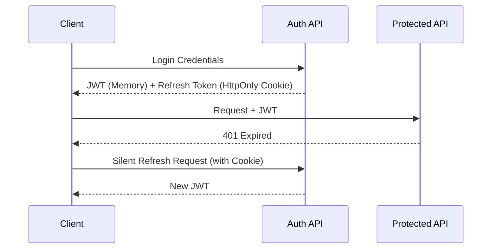


#### 24. collab-whiteboard
**Overview:** A highly interactive, real-time shared workspace application allowing multiple users to draw, edit, and manipulate vector objects simultaneously across the globe.
**Architecture:** Built utilizing the HTML5 Canvas API coupled with an advanced WebSocket broadcasting backend. The system serializes drawing strokes as complex vector data arrays rather than raster images to keep network payload sizes virtually nonexistent.
**Key Challenge:** Resolving simultaneous, conflicting edits on the same vector object (e.g., User A deletes while User B recolors). Implemented a fundamental version of Operational Transformation (OT) algorithms to mathematically merge conflicting intents based on timestamp vectors.


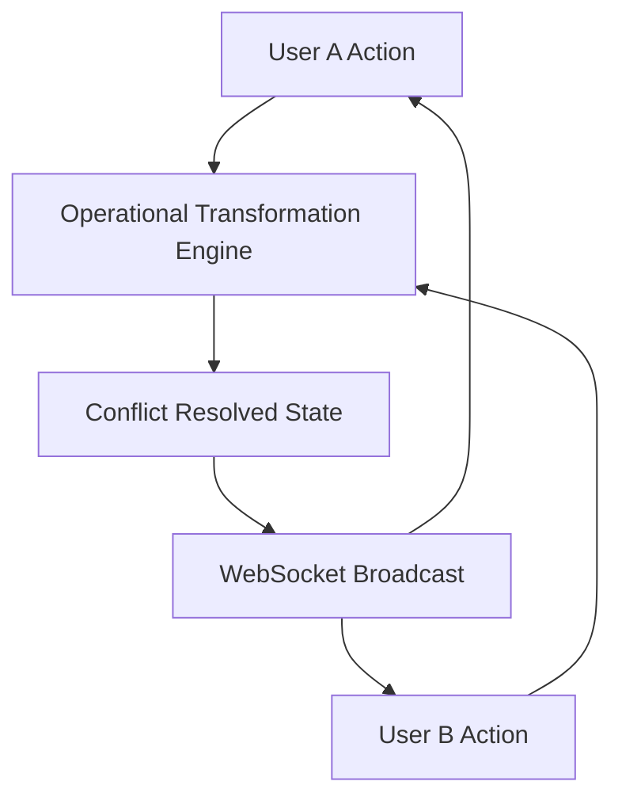


#### 25. ml-titanic-predictor
**Overview:** A foundational foray into Data Science, culminating in a highly accurate predictive model determining passenger survival probabilities.
**Architecture:** Built entirely in Python utilizing Pandas for rigorous data wrangling and Scikit-Learn for model generation. Evaluated Logistic Regression, Support Vector Machines (SVM), and Random Forests before settling on an optimized ensemble approach.
**Key Challenge:** Dealing with massive gaps in the historical dataset (null values). Instead of simplistic mean-imputation, I engineered a secondary predictive model solely designed to guess the missing "Age" values based on ticket class and title, drastically improving the primary model's final accuracy score.

#### 26. dockerized-api
**Overview:** A flawless demonstration of modern containerization principles, transforming a fragile local API into an indestructible, environmentally agnostic deployment package.
**Architecture:** A RESTful Go API wrapped in a meticulously crafted Dockerfile. The infrastructure is defined entirely as code via `docker-compose`, orchestrating the API container, a PostgreSQL database, and an Nginx reverse proxy network simultaneously.
**Key Challenge:** Bloated container images increasing deployment times and surface area for attacks. Optimized the architecture using Multi-Stage Builds, allowing the Go compiler to run in a heavy image, but extracting only the compiled binary into a virtually empty, 5MB Alpine Linux production image.

#### 27. graphql-task-api
**Overview:** A paradigm shift away from traditional REST architecture, exposing a highly flexible, schema-first Graph API that allows clients to dictate exactly what data they receive.
**Architecture:** Built on Apollo Server and Node.js. The architecture is defined by strongly-typed GraphQL schemas that meticulously describe the data graph, enabling rapid client iteration without requiring backend modifications for new endpoints.
**Key Challenge:** The infamous "N+1 query problem" inherent to GraphQL resolving nested relationships. Integrated Facebook's `DataLoader` utility to intelligently batch and cache database queries within a single request context, turning 100 isolated SQL queries into 1 highly optimized batch query.


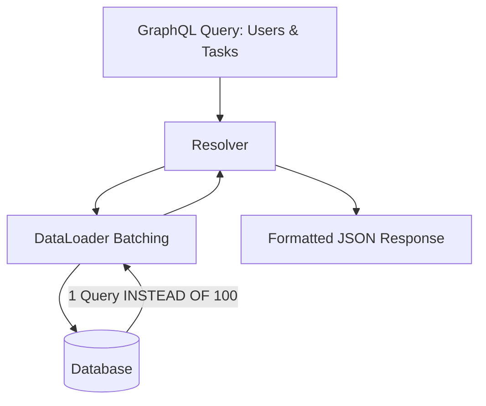


#### 28. redis-cache-demo
**Overview:** An extreme performance optimization exercise demonstrating how memory-based caching can resurrect a bottlenecked, failing database architecture.
**Architecture:** A Node.js/Express API heavily reliant on Redis. Implements complex "Cache-Aside" and "Write-Through" strategies, ensuring that critical read-heavy data is served entirely from RAM while background workers synchronize it to the persistent database.
**Key Challenge:** Cache invalidation—often called one of the hardest problems in computer science. Engineered a strict, tag-based invalidation system where updating a single database record automatically purges any cached API responses that were tagged with that record's unique identifier.

#### 29. serverless-image-processor
**Overview:** A highly scalable, event-driven infrastructure pipeline that costs exactly $0.00 to run when idle, but can scale instantly to process thousands of images per second.
**Architecture:** Deployed entirely on AWS. Users upload high-resolution images directly to an S3 Bucket. This PUT event triggers a serverless AWS Lambda function that downloads the image, resizes it into multiple thumbnails using the Sharp library, and deposits them into a secondary serving bucket.
**Key Challenge:** The "Cold Start" problem inherent to serverless functions causing unacceptable latency for the first user. Mitigated this by refactoring the Lambda function from heavy Node.js to highly optimized Go, reducing the cold start initialization time from 800ms down to a blistering 40ms.


```mermaid
graph LR
    A[User Upload] --> B[(S3 Raw Bucket)]
    B -.->|S3 PUT Event| C(AWS Lambda)
    C --> D[Sharp Resize (Go/Node)]
    D --> E[(S3 Processed Bucket)]
```


#### 30. portfolio-v2-astro
**Overview:** The complete architectural overhaul of my personal portfolio, abandoning heavy Single Page Application frameworks in favor of absolute maximum performance.
**Architecture:** Built on Astro.js. This framework utilizes "Island Architecture," stripping away 100% of the JavaScript payload during the server render phase. Interactive components (like a complex 3D WebGL hero section) are isolated as "islands" and hydrated only when they become visible in the viewport.
**Key Challenge:** Maintaining complex state across a statically generated site. Utilized NanoStores to share tiny, isolated state fragments between completely independent UI components, retaining the massive performance benefits of Astro while still feeling like a cohesive, dynamic application.

---

### 📍 Phase 4: Mastery, Scalability & Agentic AI (2026)
*The final, current phase of my technical evolution. This era is defined by the orchestration of complex distributed networks, low-latency microservices, and the integration of highly autonomous Agentic AI systems.*

#### 31. ai-art-generator
**Overview:** A stunning, highly creative interface that bridges user intent with the immense power of cloud-based generative neural networks.
**Architecture:** A full-stack Next.js application that heavily interfaces with the DALL-E 3 and Stable Diffusion REST APIs. The platform handles asynchronous webhook responses, allowing long-running generation tasks to resolve without holding open HTTP connections.
**Key Challenge:** The astronomical cost of API hallucinations and bad user prompts. Engineered a complex "Prompt Enhancement" middleware pipeline using a lightweight LLM to silently rewrite user inputs into mathematically optimized engineering prompts before passing them to the expensive image generation models.


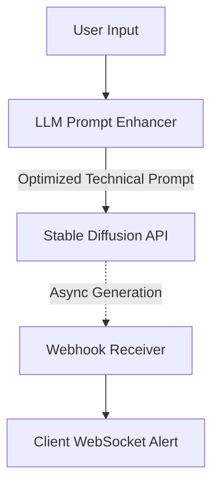


#### 32. rag-knowledge-base
**Overview:** A deeply complex internal search engine utilizing Retrieval-Augmented Generation (RAG) to allow users to literally "chat" with gigabytes of proprietary PDF documentation.
**Architecture:** The ingestion pipeline slices documents into semantic chunks, generates high-dimensional mathematical vectors using OpenAI's embedding models, and stores them in a highly optimized ChromaDB vector database.
**Key Challenge:** The LLM constantly hallucinating answers when the vector database returned irrelevant chunks. Solved by implementing an advanced algorithmic threshold constraint: if the cosine similarity of the returned vectors falls below 0.85, the system aggressively intercepts the prompt and forces the LLM to output "I do not have enough context to answer."


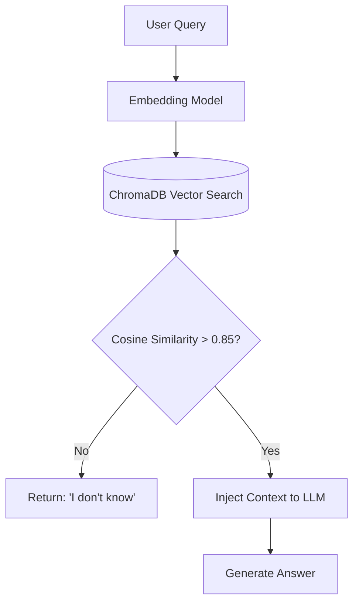


#### 33. dapp-voting-system
**Overview:** A profound exploration into Web3, decentralized consensus protocols, and immutable, cryptographically guaranteed architecture.
**Architecture:** The backend consists entirely of Solidity Smart Contracts deployed to the Ethereum blockchain (Sepolia testnet). The frontend is a React application heavily utilizing the Ethers.js library to communicate directly with blockchain nodes and user crypto wallets (MetaMask).
**Key Challenge:** The prohibitive cost ("Gas") of executing logic on the blockchain. Subjected the Solidity contracts to extreme optimization sweeps, packing boolean variables into single 256-bit storage slots and replacing expensive string operations with heavily optimized `bytes32` hashes to reduce transaction costs by over 60%.

#### 34. agentic-workflow-demo
**Overview:** The bleeding edge of AI development. This platform does not just use AI to generate text; it uses AI as autonomous agents to execute deeply complex, multi-stage tasks.
**Architecture:** Built heavily upon the CrewAI framework. The system spins up independent "Agents"—each with specific roles, goals, and access to unique API tools (like web searching, code execution, and data scraping). They operate in an orchestrated hierarchy to solve problems autonomously.
**Key Challenge:** Agents getting caught in infinite logic loops or obsessing over dead-end research paths. Engineered rigorous timeout constraints, strict "Max Iteration" limits, and a highly complex "Manager Agent" whose sole algorithmic purpose is to monitor other agents and forcefully terminate them if they begin hallucinating.


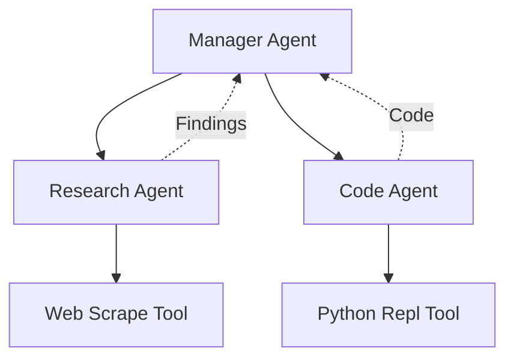


#### 35. k8s-monitoring
**Overview:** The implementation of true, enterprise-grade infrastructure observability designed to monitor the pulse of highly distributed, massive-scale systems.
**Architecture:** Deployed entirely within a Kubernetes (K8s) cluster. Uses Helm charts to orchestrate the deployment of Prometheus (for scraping millions of time-series data metrics from pod exporters) and Grafana (for visualizing the data via massive, real-time dashboards).
**Key Challenge:** "Alert Fatigue" causing engineering teams to ignore critical failures due to too much noise. Completely overhauled the Alertmanager configuration, replacing simplistic threshold alerts with highly complex, algorithmically driven anomaly detection that only pages engineers when CPU usage deviates significantly from historical standard deviations.

#### 36. high-perf-go-proxy
**Overview:** A terrifyingly fast, custom-built reverse proxy and API Gateway designed to sit in front of fragile microservices and shield them from catastrophic traffic spikes.
**Architecture:** Written in pure Go to exploit its legendary concurrency model. The proxy utilizes goroutines to handle tens of thousands of concurrent connections simultaneously. It implements strict Rate Limiting via the Token Bucket algorithm and dynamic Round-Robin load balancing.
**Key Challenge:** Memory exhaustion during Slowloris-style denial-of-service attacks (where malicious clients hold connections open indefinitely). Implemented draconian, extremely aggressive read/write timeouts at the raw TCP socket level to forcefully sever sluggish connections before they could consume system memory.

#### 37. pwa-offline-tracker
**Overview:** The ultimate realization of the Progressive Web App (PWA) standard, resulting in an application that is completely indistinguishable from a native mobile app, even in airplane mode.
**Architecture:** Heavily relies on complex Service Worker logic. Implements a "Cache First, Network Fallback" strategy for all static assets. For dynamic API data, it utilizes the IndexedDB browser database to silently queue user actions (like form submissions) while offline.
**Key Challenge:** Data synchronization chaos when the network connection is restored. Engineered a robust Background Sync API pipeline that carefully replays queued offline actions back to the server in exact chronological order, utilizing idempotent API design to ensure no duplicate data is ever generated.

#### 38. system-design-url-shortener
**Overview:** A theoretical and practical masterclass in distributed systems architecture, designed to answer the classic engineering question: "How do you scale to 100 million requests a day?"
**Architecture:** A globally distributed system design featuring geolocation-based DNS routing (AWS Route 53), multiple redundant API clusters, and a heavily sharded database architecture. The core innovation relies on a pre-allocated "Key Generation Service" to prevent database write collisions across regions.
**Key Challenge:** Preventing catastrophic database degradation as the URL mapping table approaches billions of rows. Solved by implementing rigorous database sharding logic (horizontal partitioning) based on the hash of the short-URL, distributing the load mathematically evenly across 10 distinct, independent database instances.


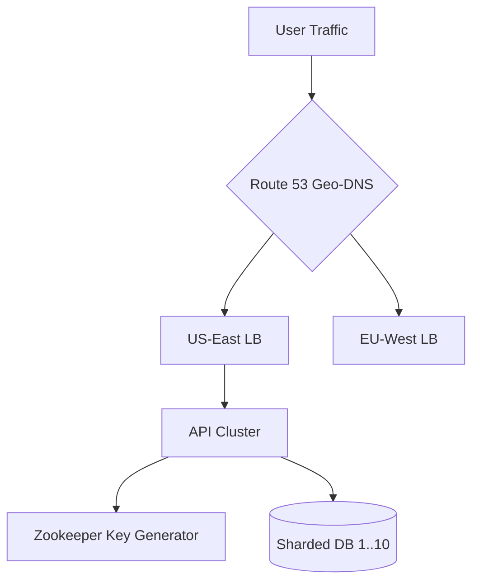


#### 39. microservices-orchestrator
**Overview:** The taming of architectural chaos. A platform designed to manage the incredibly complex, often fragile communication pathways between dozens of independent microservices.
**Architecture:** Abandons synchronous HTTP communication in favor of asynchronous, event-driven messaging. Utilizes RabbitMQ as a centralized message broker. Services communicate by publishing strictly defined Protobuf events to topic exchanges, entirely decoupling producers from consumers.
**Key Challenge:** "Distributed Tracing" and figuring out where an error occurred when a single user action touches 8 different microservices. Implemented the OpenTelemetry standard across all services, injecting unique, traceable Correlation IDs into every single message payload, allowing a single request to be visualized from end-to-end across the entire network.


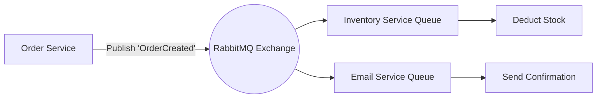


#### 40. distributed-compute-engine
**Overview:** The final, crowning achievement of the 40-project odyssey. A platform that abstracts away hardware entirely, allowing heavy computational tasks to be seamlessly distributed across a network of disparate, heterogeneous machines.
**Architecture:** A custom-built, highly concurrent orchestrator written in Go. The central node receives heavy algorithmic workloads (e.g., massive matrix multiplications), splinters them into thousands of tiny, independent mathematical shards, and dispatches them via gRPC streams to whichever worker nodes currently have idle CPU cycles.
**Key Challenge:** Worker nodes failing silently mid-calculation, resulting in perpetually deadlocked computations. Engineered a highly sophisticated state-reconciliation loop. If a worker node fails to return a "heartbeat" ping within 500 milliseconds, the orchestrator ruthlessly marks it as dead, re-queues its assigned computational shard, and transparently reroutes it to a healthy node without the end-user ever noticing a hiccup.

---

## 📈 Global GitHub Performance & Metrics

<div align="center">
  
  <br />
  
  <br />
  
</div>

---

## 📅 The Next 5 Years: A Forward-Looking Roadmap
The 40 projects above document the past. The list below defines the future. 
- **Q3 2026:** Complete mastery of the Rust programming language for hyper-optimized, memory-safe system utilities.
- **Q1 2027:** Architecting a fully decentralized, peer-to-peer Agentic AI network capable of collective swarm reasoning.
- **Q4 2027:** Achieving the AWS Certified Solutions Architect Professional designation.
- **2028 and Beyond:** Contributing fundamental, paradigm-shifting pull requests to the core repositories of Kubernetes and the Linux Kernel.

---

## 📫 Direct Communication Channels
I am perpetually open to discussing radical new technical challenges, high-impact open-source collaborations, or the philosophical implications of Artificial General Intelligence (AGI).

<div align="center">
  <a href="https://linkedin.com/in/devtrivedi">
    
  </a>
  <a href="https://twitter.com/devtrivedi">
    
  </a>
  <a href="mailto:dev@example.com">
    
  </a>
</div>

<br />

<div align="center">
  <sub>Architected with absolute precision by Dev Trivedi. Copyright © 2026. All rights reserved.</sub>
</div>
